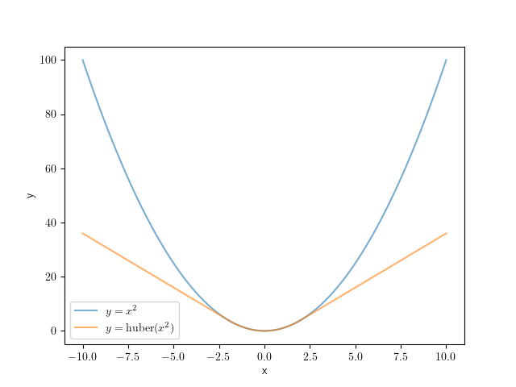

重み付きGauss-Newton
====================

:著者: 石田 岳志

Gauss-Newton法はその収束の速さからさまざまな場面で扱われる数理最適化手法であるが、一般的に誤差関数として二乗誤差を用いるため、外れ値に弱いという問題がある。

ここでは外れ値に対して頑強な誤差関数とその最適化手法について解説する。例として point-set registration を取り扱うが、ここで解説する手法は他のさまざまな最適化問題にも適用することができる。

問題設定
~~~~~~~~

最適化問題のパラメータを :math:`\mathbf{\beta} = \{\mathbf{q}, \mathbf{t}\}` で表現する。ここで :math:`\mathbf{q} \in \mathbb{H}` は回転を表す四元数、 :math:`\mathbf{t} \in \mathbb{R}^{3}` は並進を表す3次元ベクトルである。

2つの3次元点群の集合をそれぞれ :math:`P` と :math:`U` とする。

.. math::
    \begin{align}
    P &= \{\mathbf{p}_{i}\},\,\mathbf{p}_{i} \in \mathrm{R}^{3},\,i=1,...,n \\
    U &= \{\mathbf{u}_{j}\},\,\mathbf{u}_{j} \in \mathrm{R}^{3},\,j=1,...,n
    \end{align}

Point-set registration とは、これら点群を用いてなんらかの誤差関数 :math:`E` を設定し、それを最小化することで、これら点群の間の尤もらしい変換 :math:`\mathbf{\beta} = \{\mathbf{q}, \mathbf{t}\}` を求める問題である。

.. math::
    \underset{\mathbf{\beta}}{\arg\min}\, E(P, U;\, \mathbf{\beta}),

誤差関数には一般的に平均二乗誤差がよく用いられる。

.. math::
    \begin{align}
    \mathrm{MSE}(P, U; \mathbf{\beta}) &= \frac{1}{n} \sum_{i=1}^{n} || \mathbf{r}(\mathbf{p}_{i}, \mathbf{u}_{i};\, \mathbf{\beta}) ||^{2} \\[10pt]
    &\text{where}\quad\mathbf{r}(\mathbf{p}_{i}, \mathbf{u}_{i};\, \mathbf{\beta}) = R(\mathbf{q}) \cdot \mathbf{p}_{i} + \mathbf{t} - \mathbf{u}_{i}
    \end{align}

外れ値に対する脆弱性
~~~~~~~~~~~~~~~~~~~~

さて、ここで問題がある。平均二乗誤差は外れ値に弱いため、入力データ :math:`P,\, U` に少しでも外れ値が含まれていると、パラメータの推定結果 :math:`\hat{\mathbf{\beta}}` は真の値 :math:`\mathbf{\beta}^{*}` から大きく外れてしまう。

外れ値に対する頑強性の確保
~~~~~~~~~~~~~~~~~~~~~~~~~~

この問題に対処するための方法は数多く提案されており、ここではGauss-Newtonの最適化プロセスとともによく用いられる重み付けGauss-Newton法を紹介する。
これはある関数 :math:`\rho` を導入することで、平均二乗誤差よりも外れ値の影響を受けにくくする手法である。

.. math::
    E_{\rho}(\mathbf{\beta}) = \sum_{j=1}^{3} \sum_{i=1}^{n} \rho(e_{ij}),\quad
    e_{ij} = \left[\frac{r_{ij}(\mathbf{\beta})}{{\sigma_{MAD}}_{j}}\right]^{2}

ここで :math:`r_{ij}(\beta)` は :math:`\mathbf{r}_{i}(\mathbf{\beta})` の :math:`j` 次元目の要素を表している。

関数 :math:`\rho` はしばしば入力値の標準偏差が1に正規化されていることを仮定する。 :math:`{\sigma_{MAD}}_{j}` は :math:`\mathbf{r}` の :math:`j` 次元目の要素の標準偏差の推定値であり、これで :math:`\mathbf{r}` をそれぞれの次元ごとに正規化している。
データには外れ値が含まれていることを仮定するため、標準偏差の計算には外れ値に対して頑強な計算手法が用いられる。これについては :doc:`別項 <robust_stddev_estimator>` で解説する。

.. math::
    {\sigma_{MAD}}_{j}=\frac{\operatorname{MAD}_{j}}{\Phi^{-1}(\frac{3}{4})},\quad\operatorname{MAD}_{j}=\operatorname{median}_{i}(\left|r_{ij}−m_{j}\right|), \quad m_{j}=\operatorname{median}_{i}(r_{ij})

:math:`\rho` にはさまざまなものが提案されており、たとえば huber loss

.. math::
    \rho(e) = \begin{cases}
        e,          & \text{if } e\lt k^2\\
        2k\sqrt{e} - k^2,  & \text{if } e\geq k^2\\
    \end{cases}

などがよく用いられる。

    通常の二乗誤差とHuber関数の比較(k=2.0)。二乗誤差と比較すると、Huber関数は大きな残差を持つサンプルに対して小さな誤差を割り当てるため、外れ値の影響が小さくなる。

通常の二乗誤差は大きな残差 :math:`\mathbf{r}_{i}` を持つサンプル(外れ値)に対して大きな誤差 :math:`e_{i}` を割り当てる。最適なパラメータ :math:`{\arg\min}_{\mathbf{\beta}} E_{s}` を求める際には、外れ値に対応する誤差を重点的に減少させようとしてしまい、結果として推定値 :math:`\hat{\mathbf{\beta}}` が外れ値に引っ張られてしまう。一方でHuber関数などは外れ値が生み出す誤差を :math:`\rho(e_{i})` として抑制するため、外れ値を重点的に扱うことはせず、結果としてロバストな推定ができるようになる。

Gauss-Newton法による誤差最小化
~~~~~~~~~~~~~~~~~~~~~~~~~~~~~~

さて、外れ値に対する頑強性を確保する関数 :math:`\rho` を導入したので、これ考慮しつつ誤差 :math:`E_{\rho}(\mathbf{\beta})` を最小化する方法を導出しよう。

通常のGauss-Newton法と同じ枠組みで誤差最小化を行う。:math:`\mathbf{\beta}_{0}` は初期値として固定されているため、 :math:`\mathbf{\delta}` のみを変動させ、誤差の値の変化を観察すればよい。
ある値 :math:`\mathbf{\beta}_0` の周辺で関数 :math:`E_{\rho}` を近似し、これを最小化するパラメータ :math:`\mathbf{\beta}_0 + \mathbf{\delta}^{*},\,\mathbf{\delta}^{*} = {\arg\min}_{\mathbf{\delta}}\, E_{\rho}(\mathbf{\beta}_0 + \mathbf{\delta})` を求めよう。

微小な変数 :math:`\Delta \mathbf{\delta}` を導入し、 :math:`E_{\rho}` を微分してその変化を観察することで、:math:`E_{\rho}` を :math:`\mathbf{\beta}_{0}` の周辺で局所的に最小化するパラメータ :math:`\mathbf{\beta}_{0} + \mathbf{\delta}^{*}` を見つけることができる。

.. math::
    \begin{align}
    \frac{\partial E_{\rho}(\mathbf{\beta})}{\partial \mathbf{\beta}}\Big|_{\mathbf{\beta}_{0} + \mathbf{\delta}}
    &=
    \lim_{\Delta\mathbf{\delta} \to \mathbf{0}}
    \frac{E_{\rho}(\mathbf{\beta}_{0} + \mathbf{\delta} + \Delta\mathbf{\delta}) - E_{\rho}(\mathbf{\beta}_{0} + \mathbf{\delta})}
    {(\mathbf{\beta}_{0} + \mathbf{\delta} + \Delta\mathbf{\delta}) - (\mathbf{\beta}_{0} + \mathbf{\delta})} \\
    &=
    \lim_{\Delta\mathbf{\delta} \to \mathbf{0}}
    \sum_{j=1}^{3}\sum_{i=1}^{n}
    \left[
    \frac
    {\rho(e_{ij}(\mathbf{\beta}_{0} + \mathbf{\delta} + \Delta\mathbf{\delta})) - \rho(e_{ij}(\mathbf{\beta}_{0} + \mathbf{\delta}))}
    {e_{ij}(\mathbf{\beta}_{0} + \mathbf{\delta} + \Delta\mathbf{\delta}) - e_{ij}(\mathbf{\beta}_{0} + \mathbf{\delta})}
    \cdot
    \frac
    {e_{ij}(\mathbf{\beta}_{0} + \mathbf{\delta} + \Delta\mathbf{\delta}) - e_{ij}(\mathbf{\beta}_{0} + \mathbf{\delta})}
    {(\mathbf{\beta}_{0} + \mathbf{\delta} + \Delta\mathbf{\delta}) - (\mathbf{\beta}_{0} + \mathbf{\delta})}
    \right] \\
    &=
    \lim_{\Delta\mathbf{\delta} \to \mathbf{0}}
    \sum_{j=1}^{3}\sum_{i=1}^{n}
    \left[
    \frac
    {\partial \rho}{\partial e_{ij}}\Big|_{e_{ij}(\mathbf{\beta}_{0} + \mathbf{\delta})}
    \cdot
    \frac
    {e_{ij}(\mathbf{\beta}_{0} + \mathbf{\delta} + \Delta\mathbf{\delta}) - e_{ij}(\mathbf{\beta}_{0} + \mathbf{\delta})}
    {\Delta\mathbf{\delta}}
    \right]
    \end{align}

:math:`\frac{\partial E_{\rho}(\mathbf{\beta})}{\partial \mathbf{\beta}}\Big|_{\mathbf{\beta}_{0} + \mathbf{\delta}} = \mathbf{0}` とおけば最適なパラメータ :math:`\mathbf{\beta}_{0} + \mathbf{\delta}^{*}` を導出することができるだろう。

:math:`r_{ij}` の微分を :math:`J_{ij}` とおいて、関数 :math:`e_{ij}` を近似する。

.. math::
    J_{ij}(\mathbf{\beta}_{0})
    =
    \frac{\partial r_{ij}}{\partial \mathbf{\beta}}\Big|_{\mathbf{\beta}_{0}}

.. math::
    \begin{align}
    {e}_{ij}(\mathbf{\beta}_{0} + \Delta\mathbf{\beta})
    &=
    \frac{1}{{\sigma_{MAD}}_{j}^{2}} \cdot r_{ij}(\mathbf{\beta}_{0} + \Delta\mathbf{\beta})^{2} \\
    &\approx
    \frac{1}{{\sigma_{MAD}}_{j}^{2}} \cdot \left[ r_{ij}(\mathbf{\beta}_{0}) + J_{ij}\Delta\mathbf{\beta}\right]^{2} \\
    &=
    \frac{1}{{\sigma_{MAD}}_{j}^{2}} \cdot
    \left[r_{ij}(\mathbf{\beta}_{0})^{2} +
    2\Delta\mathbf{\beta}^{\top}J_{ij}^{\top}r_{ij}(\mathbf{\beta}_{0}) +
    \Delta\mathbf{\beta}^{\top}J_{ij}^{\top}J_{ij}\Delta\mathbf{\beta} \right]
    \end{align}

この結果を利用すると、 :math:`e_{ij}` の微分を簡易な式で近似することができる。

.. math::
    \begin{align}
    &e_{ij}(\mathbf{\beta}_{0} + (\mathbf{\delta} + \Delta\mathbf{\delta})) - e_{ij}(\mathbf{\beta}_{0} + \mathbf{\delta}) \\
    &\approx
    \frac{1}{{\sigma_{MAD}}_{j}^{2}} \cdot
    \left\{
        \left[r_{ij}(\mathbf{\beta}_{0})^{2}
        + 2(\mathbf{\delta} + \Delta \mathbf{\delta})^{\top}J_{ij}^{\top}r_{ij}(\mathbf{\beta}_{0})
        + (\mathbf{\delta} + \Delta \mathbf{\delta})^{\top}J_{ij}^{\top}J_{ij}(\mathbf{\delta} + \Delta \mathbf{\delta})\right]
        - \left[r_{ij}(\mathbf{\beta}_{0})^{2}
        + 2\mathbf{\delta}^{\top}J_{ij}^{\top}r_{ij}(\mathbf{\beta}_{0})
        + \mathbf{\delta}^{\top}J_{ij}^{\top}J_{ij}\mathbf{\delta}\right]
    \right\} \\
    &= \frac{1}{{\sigma_{MAD}}_{j}^{2}} \cdot \left[ 2\Delta \mathbf{\delta}^{\top}J_{ij}^{\top}r_{ij}(\mathbf{\beta}_{0})
    + 2\Delta \mathbf{\delta}^{\top}J_{ij}^{\top}J_{ij}\mathbf{\delta}
    + \Delta \mathbf{\delta}^{\top}J_{ij}^{\top}J_{ij}\Delta \mathbf{\delta} \right]
    \end{align}

|

.. math::
    \begin{align}
    \lim_{\Delta\mathbf{\delta} \to \mathbf{0}}
    \frac{e_{ij}(\mathbf{\beta}_{0} + \mathbf{\delta} + \Delta\mathbf{\delta}) - e_{ij}(\mathbf{\beta}_{0} + \mathbf{\delta})}{\Delta\mathbf{\delta}}
    &\approx
    \frac{1}{{\sigma_{MAD}}_{j}^{2}} \cdot
    \lim_{\Delta\mathbf{\delta} \to \mathbf{0}}
    \frac{
    2\Delta \mathbf{\delta}^{\top}J_{ij}^{\top}r_{ij}(\mathbf{\beta}_{0})
    + 2\Delta \mathbf{\delta}^{\top}J_{ij}^{\top}J_{ij}\mathbf{\delta}
    + \Delta \mathbf{\delta}^{\top}J_{ij}^{\top}J_{ij}\Delta \mathbf{\delta}}{\Delta\mathbf{\delta}}  \\
    &=
    \frac{1}{{\sigma_{MAD}}_{j}^{2}} \cdot
    \lim_{\Delta\mathbf{\delta} \to \mathbf{0}}
    \left[
    2J_{ij}^{\top}r_{ij}(\mathbf{\beta}_{0})
    + 2J_{ij}^{\top}J_{ij}\mathbf{\delta}
    + J_{ij}^{\top}J_{ij}\Delta \mathbf{\delta}
    \right] \\
    &=
    \frac{2}{{\sigma_{MAD}}_{j}^{2}} \cdot (J_{ij}^{\top}r_{ij}(\mathbf{\beta}_{0}) + J_{ij}^{\top}J_{ij}\mathbf{\delta})
    \end{align}

さらに :math:`w_{ij} = \frac{\partial \rho}{\partial e_{ij}}\Big|_{e_{ij}(\mathbf{\beta}_{0} + \mathbf{\delta})}` とおくと、誤差関数の微分は

.. math::
    \begin{align}
    \frac{\partial E_{\rho}(\mathbf{\beta})}{\partial \mathbf{\beta}}\Big|_{\mathbf{\beta}_{0} + \mathbf{\delta}}
    &\approx
    \sum_{j=1}^{3}\sum_{i=1}^{n}
    w_{ij}
    \cdot
    \frac{2}{{\sigma_{MAD}}_{j}^{2}}
    \cdot
    (J_{ij}^{\top}r_{ij}(\mathbf{\beta}_{0}) + J_{ij}^{\top}J_{ij}\mathbf{\delta})
    \end{align}

となり、これを :math:`\mathbf{0}` とおけば線型方程式が得られる。

.. math::
    \begin{align}
    \sum_{j=1}^{3}\sum_{i=1}^{n}
    w_{ij}
    \cdot
    \frac{2}{{\sigma_{MAD}}_{j}^{2}}
    \cdot
    J_{ij}^{\top}r_{ij}(\mathbf{\beta}_{0})
    =
    -\sum_{j=1}^{3}\sum_{i=1}^{n}
    w_{ij}
    \cdot
    \frac{2}{{\sigma_{MAD}}_{j}^{2}}
    \cdot
    J_{ij}^{\top}J_{ij}\mathbf{\delta}
    \end{align}

.. math::
    \begin{align}
    b &= \sum_{j=1}^{3}\sum_{i=1}^{n}
    \frac{w_{ij}}{{\sigma_{MAD}}_{j}^{2}}
    \cdot
    J_{ij}^{\top}r_{ij}(\mathbf{\beta}_{0}) \\
    A &=
    -\sum_{j=1}^{3}\sum_{i=1}^{n}
    \frac{w_{ij}}{{\sigma_{MAD}}_{j}^{2}}
    \cdot
    J_{ij}^{\top}J_{ij} \\
    A\mathbf{\delta} &= b
    \end{align}

この線型方程式を解けば :math:`\mathbf{\beta}_{0}` の周辺で :math:`E_{\rho}(\mathbf{\beta})` を近似的に最小化させるパラメータ :math:`\mathbf{\beta}_{0} + \mathbf{\delta}^{*},\, \mathbf{\delta}^{*} = A^{-1}b` を見つけることができる。

あとは通常のGauss-Newton法と同じように :math:`\mathbf{\beta}_{m+1} = \mathbf{\beta}_{m} + \mathbf{\delta}` とし、誤差関数 :math:`E_{\rho}` を最小化する操作を誤差またはパラメータの変化が収束するまで繰り返せばよい。
